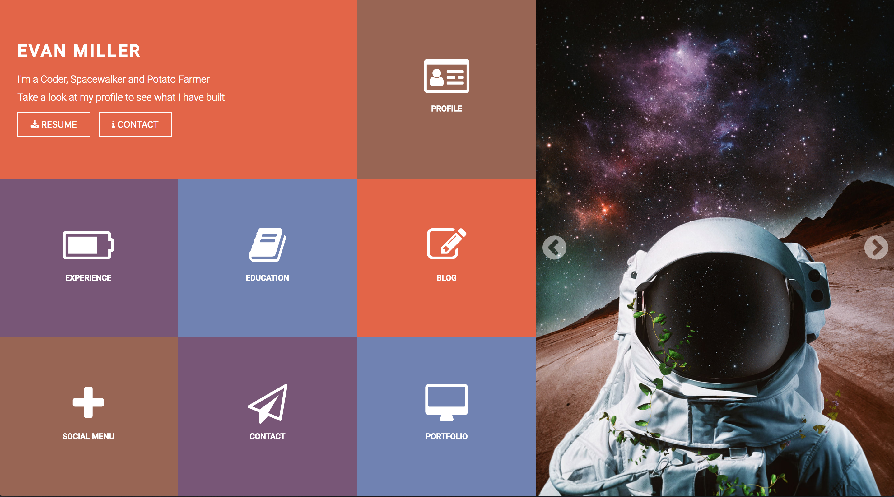

http://frontend.turing.io/projects/m1-static-comp-1.html

#### For this assignment, I was asked to create a responsive website based on a design our cohort gave us. To achieve a responsive website, I incorporated the use of "flexbox", percentages, and view-heights. My image is a picture of a Spaceman, whom I sampled my color palette from for the grid of boxes in my design. Overall, I feel this was a great project to build for an array of devices. The thinking of organizing layout in the beggining, I felt was important to complete this assignment.

The original image, my site is based on.

